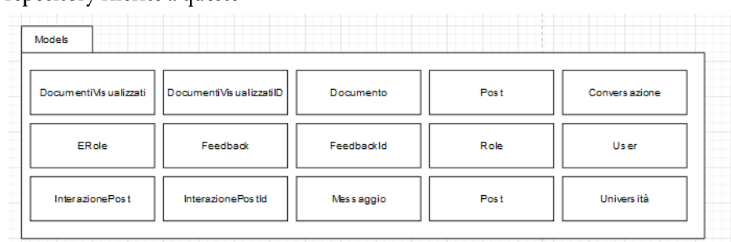
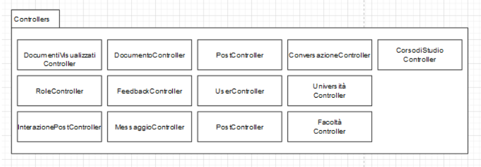
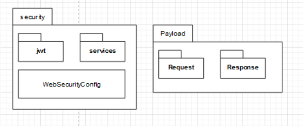
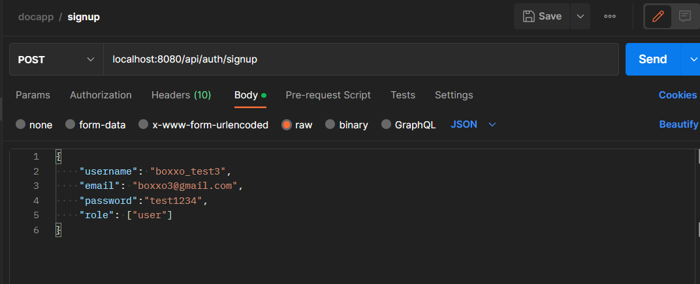
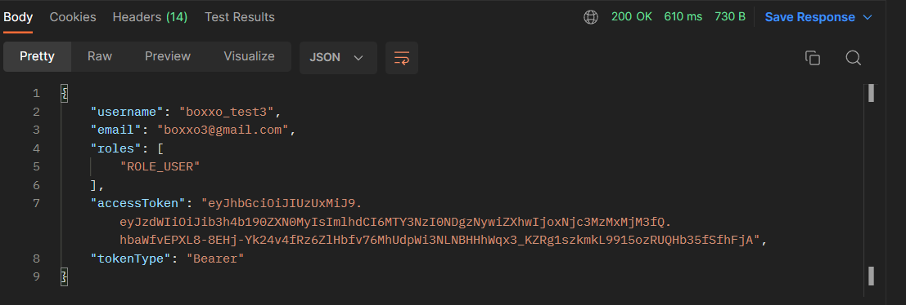

# Backend Docapp

## In breve

Questa repository rappresenta il back-end dell'applicazione Docapp creata per l'esame di Ingegneria del software, all'interno
della repository si può trovare la cartella tests, in cui sono presenti i testing di unità effettuati con Junit e Mockito. Sono presenti le cartelle
contenenti i file rappresentanti la logica dell'applicazione ed il lato di persistenza dei dati; gestiti tramite springboot, nascondendo il lato implementativo e fornendo maggiore sicurezza al sistema.
In riferimento alla documentazione di Ingegneria del Software, questa repository rappresenta la rappresentazione grafica del packaging, in cui sono definite le stesse classi che sono state trascritte nell'ODD; nella stessa repository, per di più, sono presenti le interfacce repository raffiguranti il design pattern utilizzato nel nostro sistema (Repository Pattern). Oltre gli elementi sopracitati sono anche presenti la connessione con il server effettuata per permettere le operazioni di back-end nell'applicazione

### Di seguito il packaging dei models

### Di seguito il packaging dei controllers

### Le richieste passano tutte tramite il servizio di package security.

### Le richieste

Le richieste vengono fatte tramite un servizio di access Token.
La sessione dura:
tuttavia si potrebbe estendere aggiungendo un servizio di Refresh Token

Una richiesta di autenticazione invece risulterà in:
